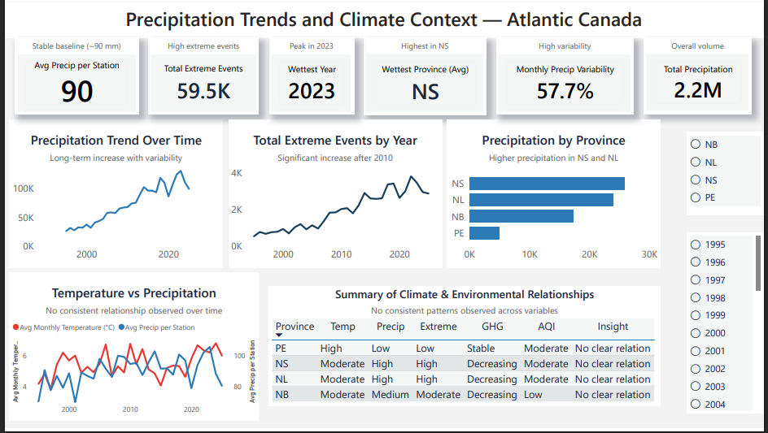
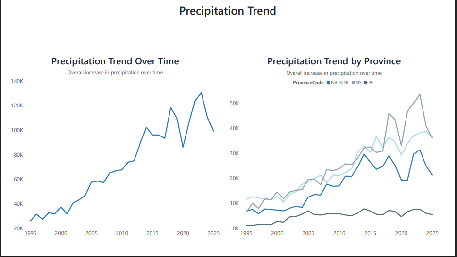
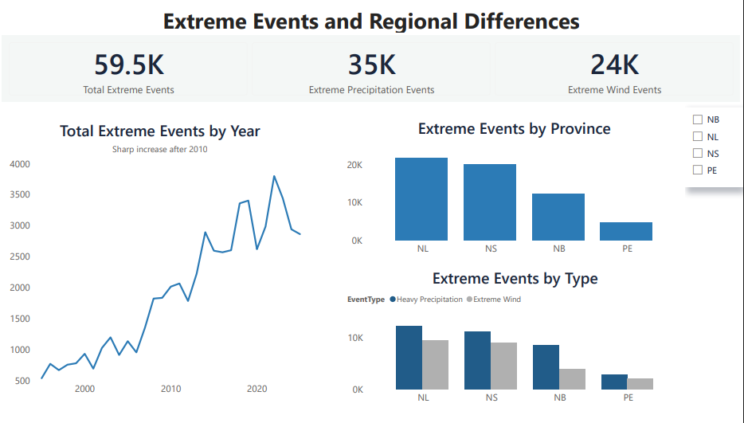
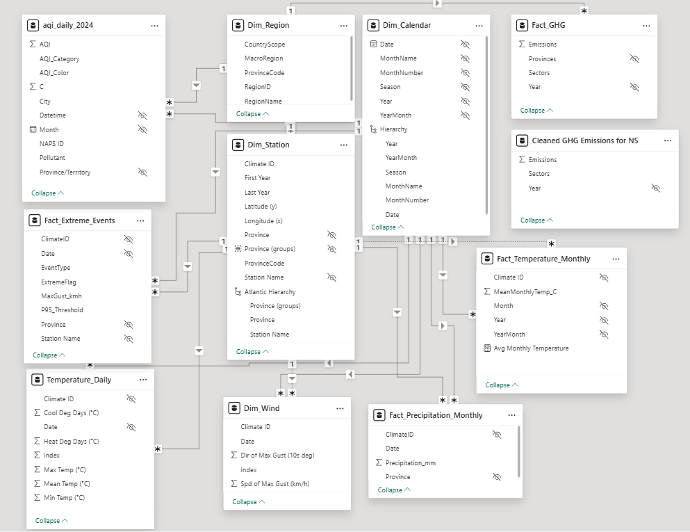

# Environment & Climate Analytics — Atlantic Canada

**NSCC Capstone Project | 2026**

An applied Business Intelligence and Data Analytics project exploring long-term environmental and climate patterns across Atlantic Canada, with a focus on **precipitation and extreme weather events**.

The project followed an end-to-end analytics workflow, from data preparation and exploratory analysis to data modeling and interactive visualization in Power BI.

---

## Project Overview

Climate and environmental datasets can reveal important patterns in precipitation, weather events, and long-term climate conditions. The goal of this project was to transform publicly available environmental data into structured, decision-ready insights through data preparation, analysis, and visualization.

The project was developed as part of the **Business Intelligence & Analytics program at Nova Scotia Community College (NSCC)**.

### My Contribution

**Data Lead & SQL/ETL Analyst**

**Primary focus: Precipitation & Extreme Weather Events**

My contribution included:

* Preparing and analyzing precipitation and extreme weather datasets
* Performing exploratory data analysis using **Python and Pandas**
* Investigating patterns and trends in extreme weather events
* Supporting data preparation and ETL activities
* Working with structured datasets for analytical reporting
* Developing and refining Power BI visualizations for precipitation and extreme weather analysis
* Contributing to data modeling and project documentation

This was a collaborative capstone project, with different team members responsible for different analytical areas.

---

## Analytical Workflow

```text
Environmental Data
        ↓
Data Cleaning & Preparation
        ↓
Python / Pandas
        ↓
Exploratory Data Analysis
        ↓
Extreme Weather Analysis
        ↓
Data Modeling / ETL
        ↓
Power BI
        ↓
Interactive Dashboard
```

---

## Dashboard

The final Power BI deliverable focuses on **precipitation patterns and extreme weather events**.

### Dashboard Preview







**[View the full dashboard PDF](dashboard/Precipitation_ExtremeEvents_v3.pdf)**

The original Power BI file is also included in the repository:

`power-bi/Precipitation_ExtremeEvents_v3.pbix`

---

## Python Analysis

Python was used as part of the data preparation and exploratory analysis process.

The repository includes notebooks covering:

* **Extreme Event Analysis** — analysis of extreme weather events and related patterns
* **Pandas EDA — Extreme Events** — exploratory data analysis and data investigation
* **Monthly Temperature Analysis** — analysis of monthly climate data

These notebooks demonstrate practical academic experience working with **Python, Pandas, data cleaning, exploratory analysis, and analytical datasets**.

---

## Data Modeling

The project incorporated a structured analytical data model to support reporting and Power BI analysis.



Supporting documentation is available in:

`data-model/Data Dictionary – Climate & Environmental Star Schema.pdf`

---

## Tools & Technologies

* **Power BI**
* **DAX**
* **Python**
* **Pandas**
* **SQL / ETL**
* **Data Modeling**
* **Exploratory Data Analysis**
* **GitHub**

### Data Sources

The project used publicly available environmental and climate datasets, including data from **Environment and Climate Change Canada (ECCC)** and other Canadian federal data sources.

---

## Project Structure

```text
environment-climate-analytics-atlantic-canada/
│
├── dashboard/
│   ├── Precipitation_ExtremeEvents_v3.pdf
│   └── screenshots/
│       ├── precipitation-overview.png
│       ├── precipitation-trends.png
│       └── extreme-weather-events.png
│
├── data-model/
│   ├── Conceptual_Climate_Star_Schema.png
│   └── Data Dictionary – Climate & Environmental Star Schema.pdf
│
├── power-bi/
│   └── Precipitation_ExtremeEvents_v3.pbix
│
├── python/
│   ├── Extreme Event.ipynb
│   ├── Pandas EDA_Extreme_Events.ipynb
│   └── Monthly_Temperature.ipynb
│
└── README.md
```

---

## Key Takeaways

This project provided hands-on experience applying Business Intelligence and Data Analytics concepts to a real-world environmental dataset.

It demonstrates my ability to:

* Work with complex datasets and transform raw information into structured analytical data
* Use Python and Pandas for data preparation and exploratory analysis
* Investigate trends and patterns in environmental data
* Contribute to ETL and data modeling processes
* Develop analytical dashboards using Power BI
* Communicate analytical findings through visualizations
* Collaborate within a multidisciplinary capstone team

---

**Project completed as part of the Business Intelligence & Analytics program at Nova Scotia Community College (NSCC), 2026.**
